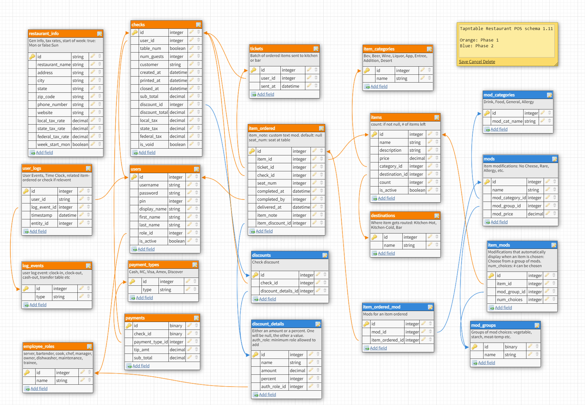

# **tapntable - backend**
**Tapntable** is a web-based restaurant point of sale system (POS): This is the backend for the system. It implements a postgresql database with a RESTful API.

The Front end is a React-Redux web-based user interface that creates user terminals for servers and bartenders as well as destination points for sent orders (kitchen and service bar)

---  
## Database Schema  
The current version of the database schema (v1.9) is below.
* The orange tables represent phase 1 and are currently implemented.
* The blue tables are for phase 2.  
* Note: the `checks` and the `item_ordered` tables contain a `discount_id` column. This column is currently unused and will reference the table `discounts` when phase 2 is implemented.

### Regarding users, login and auth:

User currently includes these fields:  
* id (serial primary key)
* username (unique)
* password
* pin (unique) (Used by user to punch-in, log-in and use the frontend interface)
* display_name (Name displayed on frontend interface and printed checks)
* first_name
* last_name
* role_id (role determining POS response and allowed actions)
* is_active (Boolean, to mark employees no longer active)

Logging in and out of a typical Restaurant POS is typically different than a standard web app. Access to the POS during a shift needs to be a fast action. The way that it is implemented in every system I've ever seen is by using a PIN. A user "logs in" upon arrival to work by typing in a unique (usually 4 digit) PIN. (No username) This action clocks in the user and enables them to then create orders.

To enter an order, the user enters their pin at a terminal. (A restaurant may have more than one terminal and the result should be the same regardless of which terminal is used.) If the user is clocked-in already, they now see the view showing their current checks if any (and edit them) and allows them to create new checks.

At the end of a shift the server must "cash-out" reconciling their checks and money and then punch out.

Users that don't create orders (cooks for instance) only punch in and out. They would never be shown a view to create a check.

Usually a manager/owner accesses the system from an office computer (usually for viewing/printing reports, adding/editing menu items, adding/editing users etc) in addition to logging into the server/bartender terminals as needed.

Thus, I'm working out some authentication questions:
Logging in from an office computer or remotely a username/password makes sense.

From the server/bartender terminals I'm trying to figure out the best plan. Here are a few possible solutions:

1. The terminals are "set up once" and always have a token to access the database
    * Only access from the office or from another location would require login
    * This is what appears to be happening at most restaurants currently. Sometimes this is a closed system with the database hosted locally, but now more systems use cloud databases.
    * The server/bar terminals are typically always running the software, and auto-boot upon powerup.
    * Users never use the local operating system.
    * Servers/Bartenders simply enter their unique pin to clock-in/create checks
    * Perhaps a token could be refreshed regulary (see option 3)
    * This would be the easiest. Are there potential security issues?

2. When the manager closes a day the token is refreshed and is now ready for the next day
    * This would allow an employee to log in even if a manager hasn't logged in to start the day
    * The system generates a new token and stores it locally.
    * Now that the system has been started, employees can access with their pin
    * The employee role will decide the actions of the POS and what they can do
    * It would be helpful if this could be done on one terminal and all server terminals would "logged in"
    * Could cause problems if a user with inadequate access has to start a day

Update: My current thinking is to separate the idea of authenticating to the database and authenticating to the user terminals. Currently, the backend is set up with username/password authentication that creates a token that contains username and roleId. I'm thinking that the terminals can act as a "manager" and be given a manager's token. The interface will query a user's roleId and allow or disallow functionality based on that. To interact with the terminals a user has a pin.  
If a user needed to access the backend from somewhere other than a restaurant terminal, they would need to authenicate with username and password.

## Routes
### Auth Routes
POST /auth/token {username, password} => { token }  
* All fields are required
* Returns JWT token which can be used to authenticate further requests  
* Token fields: { username, RoleId, iat }  
* Authorization required: none

POST /auth/register { username, password, pin, displayName, firstName, lastName, roleId } => { token }  
* All fields are required
* roleId is set to 1 automatically (trainee: lowest auth level) 
* isActive is set to true automatically upon creation  
* Returns JWT token which can be used to authenticate further requests  
* Authorization required: none

**All auth tests currently pass**

### Auth Middleware
* authenticateJWT
* ensureLoggedIn
* ensureManager
  * must have roleId >= 10 (Manager or Owner)
* ensureCorrectUserOrManager
  * must be same user or have roleId >= 10 (Manager or Owner)

**All middleware tests currently pass**
  
### User Routes
POST /users {username, password, pin, displayName, firstName, lastName, roleId, isActive} => { token }
* Required fields: username, password, pin, displayName, firstName, lastName, roleId
* isActive is optional. If ommitted, defaults to true
* Returns a JWT token which can be used to authenticate further requests
* Authorization required: manager or owner (roleId = 10 or 11)

GET /users => { users: [ {id, username, pin, displayName, firstName, lastName, role, isActive }, ... ] }
* Returns a list of all users
  * Optional search-query: firstName, Filters for items like firstName, case insensitive
  * Optional search-query: lastName, Filters for items like lastName, case insensitive
  * Optional search-query: displayName, Filters for items like display_name, case insensitive
  * Optional search-query: roleId: Filters for items with role_id that matches
  * Optional search-query: isActive: Filters for items with is_active that matches
* Authorization required: manager or owner (roleId = 10 or 11)

GET /users/:username => { id, username, pin, displayName, firstName, lastName, role, isActive }
* Returns user record for requested user
* Throws NotFoundError if user not found
* Authorization required: same user-as-:username or manager or owner (roleId = 10 or 11)

PATCH /users/:username => {user}
* Data can include: { username, password, pin, displayName, firstName, lastName, roleId, isActive }
* Returns { id, username, pin, displayName, firstName, lastName, roleId, isActive }
* Throws NotFoundError if user not found
* Authorization required: manager or owner (roleId = 10 or 11)

DELETE /users/:username => { deleted: username }
* Returns the username deleted
* Throws NotFoundError if user not found
* Authorization required: manager or owner (roleId = 10 or 11)
* **Once a user has any activity (first time punching in) deleting should not be allowed: instead is_active=false**

**All tests for user model and user routes pass**  

### Items routes

POST /items  { name, description, price, category_id, destination_id }  => {item: { id, name, description, price, category_id, destination_id, count, is_active }
* Required fields: { name, price, category_id, destination_id }
* count is set to NULL
* isActive is set to true
* Authorization required: manager or owner (roleId = 10 or 11)

GET /items => { items: [ { id, name, description, price, category_id, destination_id, count, is_active }, ...] }
* Returns a list of all items
  * Optional search-query: name, Filters for items like name, case insensitive
  * Optional search-query: description, Filters for items like name, case insensitive
  * Optional search-query: categoryId: Filters for items with category_id that matches
  * Optional search-query: destinationId: Filters for items with destinationy_id that matches
  * Optional search-query: count: Filters for items with count that matches
  * Optional search-query: isActive: Filters for items with is_active that matches
* Authorization required: user is logged in

GET /items/:id  => { id, name, description, price, category_id, destination_id, count, is_active }
* Returns item record for requested item
* Throws NotFoundError if user not found
* Authorization required: user is logged in

PATCH /items/:id => { id, name, description, price, category_id, destination_id, count, is_active }
* Data can include: { name, description, price, category_id, destination_id, count, is_active }
* Returns { id, name, description, price, category_id, destination_id, count, is_active }
* Throws NotFoundError if user not found
* Authorization required: manager or owner (roleId = 10 or 11)

DELETE /items/:id => { deleted: id }
* Returns the id of deleted item
* Throws NotFoundError if item not found
* Authorization required: manager or owner (roleId = 10 or 11)  
**(Items should not be deleted, instead is_active=false)**

**All item model and routes tests pass**

### Categories routes

POST /items/categories  { name } => { id, name }
* Creates a new category
* Required fields: name
* Authorization required: manager or owner (roleId = 10 or 11)

GET /items/categories  => { categories: [ { id, name }, ...] }
* Returns a list of all categories in order by name
  * Optional search-query: name, Filters for items like name, case insensitive
* Authorization required: user is logged in

GET /items/categories/:id  => { id, name }
* Returns the id and name of a category
* Throws NotFoundError if user not found
* Authorization required: user is logged in

PATCH /items/categories/:id => { category }
* Data can include { name }
* Returns { id, name }
* Throws NotFoundError if category not found
* Authorization required: manager or owner (roleId = 10 or 11)

DELETE /items/categories/:id => {deleted: id}
* Returns the id of deleted item
* Throws NotFoundError if category not found
* Authorization required: manager or owner (roleId = 10 or 11)  
**(Categories should not be deleted, if needed, implement is_active)**

### Destination routes

POST /items/destinations  { name } => { id, name }
* Creates a new destination
* Required fields: name
* Authorization required: manager or owner (roleId = 10 or 11)

GET /items/destinations  => { destinations: [ { id, name }, ...] }
* Returns a list of all destinations in order by name
  * Optional search-query: name, Filters for items like name, case insensitive
* Authorization required: user is logged in

GET /items/destinations/:id  => { id, name }
* Returns the id and name of a destination
* Throws NotFoundError if user not found
* Authorization required: user is logged in

PATCH /items/destinations/:id => { category }
* Data can include { name }
* Returns { id, name }
* Throws NotFoundError if user not found
* Authorization required: manager or owner (roleId = 10 or 11)

DELETE /items/destinations/:id => {deleted: id}
* Returns the id of deleted destination
* Throws NotFoundError if destination not found
* Authorization required: manager or owner (roleId = 10 or 11)  
**(Destinations should not be deleted, if needed, implement is_active)**

### Checks routes
POST /checks  { userId, tablId, customer, numGuests } => { id, user_id, table_num, num_guests, customer, created_at, sub_total, local_tax, state_tax, federal_tax }
* Required fields: { userId, tablId, numGuests }
* created_at is timestamped with current datetime
* is_void is set to false
* Authorization required: logged in to current user

GET /checks => { checks: [{ id, userId, employee, tableNum, numGuests, customer, createdAt, printedAt, closedAt, discountId, subTotal, discountTotal, localTax, stateTax, federalTax, isVoid }, ...]}}
* Returns a list of all checks
  * Optional search-query: userId: Filters for items with user_id that matches
  * Optional search-query: employee, Filters for checks like displayName, case insensitive
  * Optional search-query: tableNum: Filters for items with tableNum that matches 
  * Optional search-query: numGuests: Filters for items with numGuests that matches
  * Optional search-query: customer, Filters for checks like customer, case insensitive
  * Optional search-query: createdAt: Filters for items with createdAt that matches
  * Optional search-query: printedAt: Filters for items with printedAt that matches
  * Optional search-query: closedAt: Filters for items with closedAt that matches
  * Optional search-query: discountId: Filters for items with discountId that matches
  * Optional search-query: isVoid: Filters for items with isVoid that matches
* Authorization required: logged in to current user

GET /checks/:id  => {check: { id, userId, employee, tableNum, numGuests, customer, createdAt, printedAt, closedAt, discountId, subTotal, discountTotal, localTax, stateTax, federalTax, isVoid }}
* Returns check record that matches id
* Throws NotFoundError if user not found
* Authorization required: logged in to current user

PATCH /checks/:id => {check: { id, userId, employee, tableNum, numGuests, customer, createdAt, printedAt, closedAt, discountId, subTotal, discountTotal, localTax, stateTax, federalTax, isVoid }}
* Data can include: { tableNum, numGuests, customer, printedAt, closedAt, discountId, subTotal, discountTotal, localTax, stateTax, federalTax, isVoid }
* Throws NotFoundError if user not found
* Authorization required: logged in to current user

DELETE /checks/:id
* Returns the id of deleted item
* Throws NotFoundError if item not found
* Authorization required: manager or owner (roleId = 10 or 11)  
**(Checks should not be deleted, instead is_void=true)**
---

## Routes to be completed:
### User routes
GET /users/roles  
GET /users/logs

### Checks routes
POST /checks/:id  
PATCH /checks/:id/items/:id  
GET /checks/:id/items  
* returns a list of items ordered related to check  
DELETE /checks/:id/items/:id

GET /checks/:id/payments
* returns a list of payments related to check

### Payments
POST /payments
GET /payments  
GET /payments/:id  

### Restaurant Info
GET /info  
POST /info  
PATCH /info

