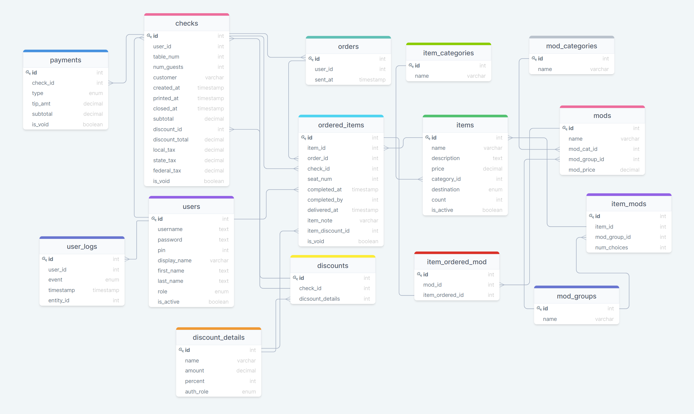

# **tapntable - backend**
**Tapntable** is a web-based restaurant point of sale system (POS): This is the backend for the system. It implements a postgresql database with a RESTful API.

The Front end is a React-Redux web-based user interface that creates user terminals for servers and bartenders as well as destination points for sent orders (kitchen and service bar)

## Deployment
The backend is currently deployed to:
https://tapntable.herokuapp.com/

---  
## Database Schema  
The current version of the database schema (v1.9) is below.
* payments, users, user_logs, checks, items, item_categories, orders, and ordered_items represent phase 1 and are currently implemented.
* discounts, discount_details, mods, mod_categories, item_mods, item_ordered_mod, and mod_groups are for phase 2.  
* Note: the `checks` and the `item_ordered` tables contain a `discount_id` column. This column is currently unused and will reference the table `discounts` when phase 2 is implemented.



### Regarding users, login and auth:

User currently includes these fields:  
* id (serial primary key)
* username (unique)
* password
* pin (unique) (Used by user to punch-in, log-in and use the frontend interface)
* display_name (Name displayed on frontend interface and printed checks)
* first_name
* last_name
* role (role determining POS response and allowed actions: This is an enum)
* is_clocked_in
* is_active (Boolean, to mark employees no longer active)

Logging in and out of a typical Restaurant POS is typically different than a standard web app. Access to the POS during a shift needs to be a fast action. The way that it is implemented in every system I've ever seen is by using a PIN. A user "logs in" upon arrival to work by typing in a unique (usually 4 digit) PIN. (No username) This action clocks in the user and enables them to then create orders.

To enter an order, the user enters their pin at a terminal. (A restaurant may have more than one terminal and the result should be the same regardless of which terminal is used.) If the user is clocked-in already, they now see the view showing their current checks if any (and edit them) and allows them to create new checks.

At the end of a shift the server must "cash-out" reconciling their checks and money and then punch out.

Users that don't create orders (cooks for instance) only punch in and out. They would never be shown a view to create a check.

Usually a manager/owner accesses the system from an office computer (usually for viewing/printing reports, adding/editing menu items, adding/editing users etc) in addition to logging into the server/bartender terminals as needed.

Each terminal must be logged into once a day with username and password. This will set a token which expires in 23 hours. Employees using the terminals will be identified by their pin to determine what they see and can do on a terminal. The token that was set (probably by a manger) will be the token used for all db queries from that terminal. In practice, a manager could refresh the tokens when performing the nightly "close-day" functions so that the terminals are ready to go in the morning without the need of the manager to be there.

## Routes
### Auth Routes
POST /auth/token {username, password} => { token }  
* All fields are required
* Returns JWT token which can be used to authenticate further requests  
* Token fields: { username, role, iat, exp }  
* Roles are: { 'trainee', 'employee', 'cook', 'host', 'server', 'bartender', 'head-server', 'bar-manager', 'chef', 'manager', 'owner' }
* Authorization required: none

POST /auth/register { username, password, pin, displayName, firstName, lastName, role } => { token }  
* All fields are required
* role is set to trainee: lowest auth level
* isActive is set to true automatically upon creation  
* Returns JWT token which can be used to authenticate further requests  
* Authorization required: none


**All auth tests currently pass**

### Auth Middleware
* authenticateJWT
* ensureLoggedIn
* ensureManager
  * must have role (Manager or Owner)
* ensureCorrectUserOrManager
  * must be same user or have roleId >= 10 (Manager or Owner)

**All middleware tests currently pass**
  
### User Routes
POST /users {username, password, pin, displayName, firstName, lastName, role} => { token }
* Required fields: username, password, pin, displayName, firstName, lastName, role
* role defaults to 'trainee' if the value is omitted
* isActive is optional. If ommitted, defaults to true
* isClockedIn is automatically set to false
* Returns a JWT token which can be used to authenticate further requests
* Authorization required: manager or owner

GET /users => { users: [ {id, username, pin, displayName, firstName, lastName, role, isClockedIn, isActive }, ... ] }
* Returns a list of all users
  * Optional search-query: firstName, Filters for items like firstName, case insensitive
  * Optional search-query: lastName, Filters for items like lastName, case insensitive
  * Optional search-query: displayName, Filters for items like display_name, case insensitive
  * Optional search-query: role: Filters for items with role that matches
  * Optional search-query: isClockedIn: Filters for items with is_clocked_in that matches
  * Optional search-query: isActive: Filters for items with is_active that matches
  * Optional search-query: desc: List returned is sorted by lastName, desc=true reverses sort
* Authorization required: manager or owner

GET /users/:username => { id, username, pin, displayName, firstName, lastName, role, isClockedIn, isActive }
* Returns user record for requested user matching username
* Throws NotFoundError if user not found
* Authorization required: same user-as-:username or manager or owner

POST /users/pin => { pin: {user} }
* This route is for a user to locally identify themselves with a pin. The device must already have a valid token stored
* Required: pin
* Returns: {user: { id, pin, displayName, role, isClockedIn, isActive }}
* Authorization required: same user-as-:username or manager or owner

POST /users/timeclock => { pin: {user} }
* This is a special route for updating the isClockedIn field in the users table
* Required: { userId, isClockedIn }
* Returns: { user: { id, pin, displayName, role, isClockedIn, isActive } }
* Authorization required: same user-as-:username or manager or owner

PATCH /users/:username => {user}
* Data can include: { username, password, pin, displayName, firstName, lastName, role, isClockedIn, isActive }
* Returns { id, username, pin, displayName, firstName, lastName, roleId, isClockedIn, isActive }
* Throws NotFoundError if user not found
* Authorization required: manager or owner

DELETE /users/:username => { deleted: username }
* Returns the username deleted
* Throws NotFoundError if user not found
* Authorization required: manager or owner
* **Once a user has any activity (first time punching in) deleting should not be allowed: instead is_active=false**

**All tests for user model and user routes pass**  

## Logs routes
POST /users/logs { userId, event, entity_id } => { log: { id, userId, event, timestamp, entity_id } }
* Required fields: { userId, event, entity_id }
* timestamp is automatically set
* Authorization required: user is logged in

GET /users/logs => { logs:[ { id, userId, event, timestamp, entity_id }...]}
* Returns a list of all logs
  * Optional search-query: userId
  * Optional search-query: type
  * Optional search-query: timestamp
  * Optional search-query: entityId
* Authorization required: user is logged in

GET /users/logs/:id  => {log: { id, userId, event, timestamp, entity_id }}
* Returns log record for requested item
* Throws NotFoundError if user not found
* Authorization required: user is logged in

### Items routes

POST /items  { name, description, price, category_id, destination_id }  => {item: { id, name, description, price, category_id, destination_id, count, is_active }
* Required fields: { name, price, category_id, destination_id }
* count is set to NULL
* isActive is set to true
* Authorization required: manager or owner (roleId = 10 or 11)

GET /items => { items: [ { id, name, description, price, category_id, destination_id, count, is_active }, ...] }
* Returns a list of all items
  * Optional search-query: name, Filters for items like name, case insensitive
  * Optional search-query: description, Filters for items like name, case insensitive
  * Optional search-query: categoryId: Filters for items with category_id that matches
  * Optional search-query: destinationId: Filters for items with destinationy_id that matches
  * Optional search-query: count: Filters for items with count that matches
  * Optional search-query: isActive: Filters for items with is_active that matches
* Authorization required: user is logged in


GET /items/:id  => { id, name, description, price, category_id, destination_id, count, is_active }
* Returns item record for requested item
* Throws NotFoundError if user not found
* Authorization required: user is logged in

PATCH /items/:id => { id, name, description, price, category_id, destination_id, count, is_active }
* Data can include: { name, description, price, category_id, destination_id, count, is_active }
* Returns { id, name, description, price, category_id, destination_id, count, is_active }
* Throws NotFoundError if user not found
* Authorization required: manager or owner (roleId = 10 or 11)

DELETE /items/:id => { deleted: id }
* Returns the id of deleted item
* Throws NotFoundError if item not found
* Authorization required: manager or owner (roleId = 10 or 11)  
**(Items should not be deleted, instead is_active=false)**

**All item model and routes tests pass**

### Categories routes

POST /items/categories  { name } => { id, name }
* Creates a new category
* Required fields: name
* Authorization required: manager or owner (roleId = 10 or 11)

GET /items/categories  => { categories: [ { id, name }, ...] }
* Returns a list of all categories in order by name
  * Optional search-query: name, Filters for items like name, case insensitive
* Authorization required: user is logged in

GET /items/categories/:id  => { id, name }
* Returns the id and name of a category
* Throws NotFoundError if user not found
* Authorization required: user is logged in

PATCH /items/categories/:id => { category }
* Data can include { name }
* Returns { id, name }
* Throws NotFoundError if category not found
* Authorization required: manager or owner (roleId = 10 or 11)

DELETE /items/categories/:id => {deleted: id}
* Returns the id of deleted item
* Throws NotFoundError if category not found
* Authorization required: manager or owner (roleId = 10 or 11)  
**(Categories should not be deleted, if needed, implement is_active)**

### Destination routes

POST /items/destinations  { name } => { id, name }
* Creates a new destination
* Required fields: name
* Authorization required: manager or owner (roleId = 10 or 11)

GET /items/destinations  => { destinations: [ { id, name }, ...] }
* Returns a list of all destinations in order by name
  * Optional search-query: name, Filters for items like name, case insensitive
* Authorization required: user is logged in

GET /items/destinations/:id  => { id, name }
* Returns the id and name of a destination
* Throws NotFoundError if user not found
* Authorization required: user is logged in

PATCH /items/destinations/:id => { category }
* Data can include { name }
* Returns { id, name }
* Throws NotFoundError if user not found
* Authorization required: manager or owner (roleId = 10 or 11)

DELETE /items/destinations/:id => {deleted: id}
* Returns the id of deleted destination
* Throws NotFoundError if destination not found
* Authorization required: manager or owner (roleId = 10 or 11)  
**(Destinations should not be deleted, if needed, implement is_active)**

### Checks routes
POST /checks  { userId, tablId, customer, numGuests } => { id, user_id, table_num, num_guests, customer, created_at, sub_total, local_tax, state_tax, federal_tax }
* Required fields: { userId, tablId, numGuests }
* created_at is timestamped with current datetime
* is_void is set to false
* Authorization required: logged in to current user

GET /checks => { checks: [{ id, userId, employee, tableNum, numGuests, customer, createdAt, printedAt, closedAt, discountId, subTotal, discountTotal, localTax, stateTax, federalTax, isVoid }, ...]}}
* Returns a list of all checks
  * Optional search-query: userId: Filters for items with user_id that matches
  * Optional search-query: employee, Filters for checks like displayName, case insensitive
  * Optional search-query: tableNum: Filters for items with tableNum that matches 
  * Optional search-query: numGuests: Filters for items with numGuests that matches
  * Optional search-query: customer, Filters for checks like customer, case insensitive
  * Optional search-query: createdAt: Filters for items with createdAt that matches
  * Optional search-query: printedAt: Filters for items with printedAt that matches
  * Optional search-query: closedAt: Filters for items with closedAt that matches
  * Optional search-query: discountId: Filters for items with discountId that matches
  * Optional search-query: isVoid: Filters for items with isVoid that matches
* Authorization required: logged in to current user

GET /checks/:id  => {check: { id, userId, employee, tableNum, numGuests, customer, createdAt, printedAt, closedAt, discountId, subTotal, discountTotal, localTax, stateTax, federalTax, isVoid }}
* Returns check record that matches id
* Throws NotFoundError if user not found
* Authorization required: logged in to current user

PATCH /checks/:id => {check: { id, userId, employee, tableNum, numGuests, customer, createdAt, printedAt, closedAt, discountId, subTotal, discountTotal, localTax, stateTax, federalTax, isVoid }}
* Data can include: { tableNum, numGuests, customer, printedAt, closedAt, discountId, subTotal, discountTotal, localTax, stateTax, federalTax, isVoid }
* Throws NotFoundError if user not found
* Authorization required: logged in to current user

DELETE /checks/:id
* Returns the id of deleted item
* Throws NotFoundError if item not found
* Authorization required: manager or owner (roleId = 10 or 11)  
**(Checks should not be deleted, instead is_void=true)**

### Orders routes
POST /checks/orders { userId } => { order: { id, userId, sentAt} }
* Required fields { userId }
* sentAt automatically timestamped
* Authorization required: logged in to current user

GET /checks/orders => { tickets: [ { id, userId, sentAt}...]}
* Returns a list of all tickets
  * Optional search-query: userId 
  * Optional search-query: sentAt
* Authorization required: logged in to current user

GET /checks/orders/:id  
* Returns record for requested ticket
* Throws NotFoundError if user not found
* Authorization required: user is logged in

### Ordered routes
GET /ordered  
GET /ordered/:id -- return the item ordered  
PATCH /ordered/:id  
DELETE /ordered/:id

### Payments
POST /payments { check_id, type, tip_amt, subtotal } => { payment: { id, checkId, type, tipAmt, subtotal, isVoid } }  
* Required fields: { check_id, type, subtotal }
* is_void is set to false
* Authorization required: logged in to current user

GET /payments => { payments:[ { id, checkId, type, tipAmt, subtotal, isVoid }...]}
* Returns a list of all payments
  * Optional search-query: type
  * Optional search-query: isVoid
* Authorization required: user is logged in

GET /payments/:id => { payment: { id, checkId, type, tipAmt, subtotal, isVoid } }
* Returns record for requested payment
* Throws NotFoundError if user not found
* Authorization required: user is logged in

PATCH /payments/:id => { payment: { id, checkId, type, tipAmt, subtotal, isVoid } }
* Data can include: { checkId, type, tipAmt, subtotal, isVoid }
* Returns { payment: { id, checkId, type, tipAmt, subtotal, isVoid } }
* Throws NotFoundError if user not found
* Authorization required: manager or owner (roleId = 10 or 11)

DELETE /payments/:id => { deleted: id }
* Returns the id of deleted payment
* Throws NotFoundError if item not found
* Authorization required: manager or owner (roleId = 10 or 11)  
**(Payments should not be deleted, instead is_void=false)**

---

##
Deployment to Heroku:

The folder structure should be similar to this:
```
tapntable-backend
tapntable-frontend
```
It’s important to have this structure because there will be two different deployments, one for the front-end and one for the backend.  

From the backend folder run the following commands

```
$ heroku login
$ heroku create NAME_OF_APP
$ echo "web: node server.js" > Procfile
$ heroku git:remote -a NAME_OF_APP
$ git add .
$ git commit -m "ready to deploy backend"
```

These commands will create a web application and the Procfile which tells Heroku what command to run to start the server.

Now that the remote is named, run the following commands in the tapntable-backend folder. Next, push the code to Heroku and copy the local database (which is named tapntable) to the production one (so that there will be  seed data in production)

```
$ git push heroku main
$ heroku addons:create heroku-postgresql:hobby-dev -a NAME_OF_APP
$ heroku pg:push tapntable DATABASE_URL -a NAME_OF_APP
$ heroku config:set PGSSLMODE=no-verify
$ heroku open
```

If there are any errors, run heroku logs -t -a NAME_OF_APP