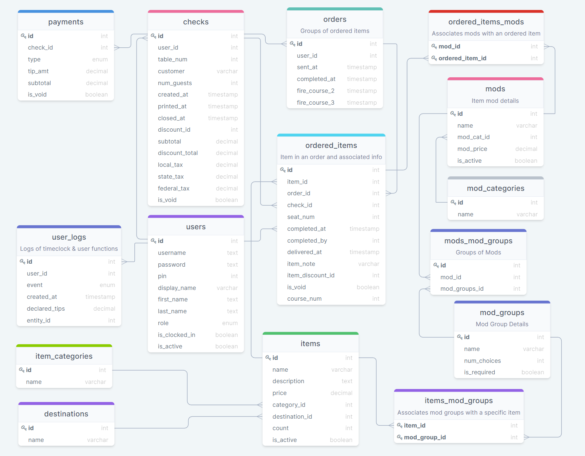

# Tapntable - backend

## Description

**Tapntable** is a web app implementing a restaurant Point of Sale (POS). It is a web-based app designed to manage the operations of a restaurant: Employee timeclock, manage checks and orders, track payments, track servers sales &  cash bank, track and manage items sold and availability. This would be used as a terminal or terminals in a restaurant for servers & bartenders to use or with tableside tablets.

At a high level, the app's backend is implemented with a PostgreSQL database and a RESTful API implemented in Javascript and Express. The frontend is implemented in React, using a Redux store and Google’s Material UI for design elements.

The front end repository: <https://github.com/Keparoo/tapntable>

## Deployment

The backend is currently deployed to: <https://tapntable.herokuapp.com/>

----

## Database Schema

The current version of the database schema (v2.2.2) is below.

* users, user_logs, checks, orders, items, ordered_items, item_categories, destinations, payments, represent phase 1 and are currently implemented.
* mods, mod_categories, ordered_items_mods, mod_groupsm mods_mod_groups, and items_mod_groups represent phase 2 and are currently implemented.  
* discounts, discount_details will be implemented next in phase 3
* Note: the `checks` and the `item_ordered` tables contain a `discount_id` column. This column is currently unused and will reference the table `discounts` when phase 3 is implemented.  
* 3 enum tables have been defined:
  * user_role
    * 'trainee', 'employee', 'cook', 'host', 'server', 'bartender', 'head-server', 'bar-manager', 'chef', 'manager', 'owner'
  * log_event
    * 'clock-in', 'clock-out', 'cash-out', 'declare-cash-tips', 'open-shift', 'close-shift', 'open-day', 'close-day', 'discount-item', 'discount-check', 'create-item', 'update-item','delete-item-ordered', 'void-item', 'void-check'
  * payment_type
    * 'Cash', 'MC', 'Visa', 'Amex', 'Disc', 'Google', 'Apple','Venmo'



### Regarding users, login and auth

User currently includes these fields:

* id (serial primary key)
* username (unique)
* password
* pin (unique) (Used by user to punch-in, log-in and use the frontend interface)
* display_name (Name displayed on frontend interface and printed checks)
* first_name
* last_name
* role (role determining POS response and user's allowed actions: This is an enum)
* is_clocked_in
* is_active (Boolean, to mark employees no longer active)

Logging in and out of a typical Restaurant POS is typically different than a standard web app. Access to the POS during a shift needs to be a fast action. A user "identifies" themselves upon arrival to work by typing in a unique (usually 4 digit) PIN. (No username) This action clocks in the user and enables them to then create orders (if their user role indicates they can create/edit orders).

To enter an order, the user enters their pin at a terminal. (A restaurant may have more than one terminal and the result should be the same regardless of which terminal is used.) If the user is clocked-in already, they now see the view showing their current checks if any (and edit them) and allows them to create new checks.

At the end of a shift the server must "cash-out" reconciling their checks and money and then punch out.

Users that don't create orders (cooks for instance) only punch in and out. Their user role would inform the front-end and they would only be shown clock-in and clock-out pages.

Usually a manager/owner accesses the system from an office computer (usually for viewing/printing reports, adding/editing menu items, adding/editing users etc) in addition to logging into the server/bartender terminals as needed.

This app will differentiate between **logging in** and **identification**.

* Authentication is handled by logging in: username and password generating a token which is used in queries to authenticate to the database.
* Identification is handled by entering a user's pin. This simply identifies which user is using a device. (This does not authenticate with the backend. This is a front-end only identification)

Each terminal must be logged into once a day with username and password. This will set a token which expires in 23 hours. Employees using the terminals will be identified by their pin to determine what they see and can do on a terminal. The token that was set (probably by a manger) will be the token used for all db queries from that terminal. In practice, a manager could refresh the tokens when performing the nightly "close-day" functions so that the terminals are ready to go in the morning without the need of the manager to be there.

There is a dashboard for the manager to create new or update existing items as well as a dedicated dashboard for specifically managing and updating the item count (This is aimed at the chef or a kitchen worker to access. A manager can manage item count from the manager's dashboard as well as all other item fields)

## Routes

### Auth Routes

POST /auth/token {username, password} => { token }

* All fields are required
* Returns JWT token which can be used to authenticate further requests  
* Token fields: { username, role, iat, exp }  
* Roles are: { 'trainee', 'employee', 'cook', 'host', 'server', 'bartender', 'head-server', 'bar-manager', 'chef', 'manager', 'owner' }
* Authorization required: none

POST /auth/register { username, password, pin, displayName, firstName, lastName, role } => { token }

* All fields are required
* role is set to trainee: lowest auth level
* isActive is set to true automatically upon creation  
* Returns JWT token which can be used to authenticate further requests  
* Authorization required: none

### Auth Middleware

* authenticateJWT
* ensureLoggedIn
* ensureManager
  * must have role (Manager or Owner)
* ensureCorrectUserOrManager
  * must be same user or have roleId >= 10 (Manager or Owner)
  
### User Routes

POST /users {username, password, pin, displayName, firstName, lastName, role} => { token }

* Required fields: username, password, pin, displayName, firstName, lastName, role
* role defaults to 'trainee' if the value is omitted
* isActive is optional. If ommitted, defaults to true
* isClockedIn is automatically set to false
* Returns a JWT token which can be used to authenticate further requests
* Authorization required: manager or owner

GET /users => { users: [ {id, username, pin, displayName, firstName, lastName, role, isClockedIn, isActive }, ... ] }

* Returns a list of all users
* Optional filter queries:
  * firstName, Filters for items like firstName, case insensitive
  * lastName, Filters for items like lastName, case insensitive
  * displayName, Filters for items like display_name, case insensitive
  * role: Filters for items with role that matches
  * isClockedIn: Filters for items with is_clocked_in that matches
  * isActive: Filters for items with is_active that matches
  * desc: List returned is sorted by lastName, desc=true reverses sort
* Authorization required: manager or owner

GET /users/:username => { id, username, pin, displayName, firstName, lastName, role, isClockedIn, isActive }

* Returns user record for requested user matching username
* Throws NotFoundError if user not found
* Authorization required: same user-as-:username or manager or owner

POST /users/pin => { pin: {user} }

* This route is for a user to locally identify themselves with a pin. The device must already have a valid token stored
* Required: pin
* Returns: {user: { id, pin, displayName, role, isClockedIn, isActive }}
* Authorization required: same user-as-:username or manager or owner

POST /users/timeclock => { pin: {user} }

* This is a special route for updating the isClockedIn field in the users table
* Required: { userId, isClockedIn }
* Returns: { user: { id, pin, displayName, role, isClockedIn, isActive } }
* Authorization required: same user-as-:username or manager or owner

PATCH /users/:username => {user}

* Data can include: { username, password, pin, displayName, firstName, lastName, role, isClockedIn, isActive }
* Returns { id, username, pin, displayName, firstName, lastName, roleId, isClockedIn, isActive }
* Throws NotFoundError if user not found
* Authorization required: manager or owner

DELETE /users/:username => { deleted: username }

* Returns the username deleted
* Throws NotFoundError if user not found
* Authorization required: manager or owner
* **Once a user has any activity (first time punching in) deleting should not be allowed: instead is_active=false**

## Logs routes

POST /users/logs { userId, event, entity_id } => { log: { id, userId, event, timestamp, entity_id } }

* Required fields: { userId, event }
* Optional fields: { declaredTips, entityId}
* timestamp is automatically set
log_event enum type values:
  'clock-in', 'clock-out', 'cash-out', 'declare-cash-tips', 'open-shift', 'close-shift', 'open-day', 'close-day', 'discount-item', 'discount-check', 'create-item', 'update-item','delete-item-ordered', 'void-item', 'void-check'
* Returns: { log: { id, userId, event, createdAt, declaredTips, entity_id } }
* Authorization required: user is logged in

GET /users/logs => { logs:[ { id, userId, displayName, firstName, LastName, role, isActive, event, createdAt, declaredTips, entity_id }...]}

* Returns a list of all logs
Optional filter queries:
  * userId
  * event
  * createdAt
  * declaredTips
  * entityId
  * before (Return records with createdAt values < before) to be deprecated
  * after (Return records with createdAt values > after) to be deprecated
  * desc (default sort by createAt, desc=true reversed sort)
  * start (Return records where createdAt >= start)
  * end (Return records where createdAt <= end)
* Authorization required: user is logged in

GET /users/logs/:id  => {log: { id, userId, event, timestamp, declaredTips, entity_id }}

* Returns log record matching log id
* Throws NotFoundError if id not found
* Authorization required: user is logged in

### Items routes

POST /items  { name, description, price, category_id, destination_id }  => {item: { id, name, description, price, category_id, destination_id, count, is_active }

* Required fields: { name, price, category_id, destination_id }
* count is set to NULL
* isActive is set to true
* Authorization required: manager or owner

GET /items => { items: [ { id, name, description, price, category_id, destination_id, count, is_active }, ...] }

* Returns a list of all items
* Optional filter queries:
  * name, Filters for items like name, case insensitive
  * description, Filters for items like name, case insensitive
  * categoryId: Filters for items with category_id that matches
  * destinationId: Filters for items with destinationy_id that matches
  * count: Filters for items with count that matches
  * isActive: Filters for items with is_active that matches
* Authorization required: user is logged in

GET /items/:id  => { id, name, description, price, category_id, destination_id, count, is_active }

* Returns item record for requested item
* Throws NotFoundError if user not found
* Authorization required: user is logged in

PATCH /items/:id => { id, name, description, price, category_id, destination_id, count, is_active }

* Data can include: { name, description, price, category_id, destination_id, count, is_active }
* Returns { id, name, description, price, category_id, destination_id, count, is_active }
* Throws NotFoundError if user not found
* Authorization required: manager or owner

DELETE /items/:id => { deleted: id }

* Returns the id of deleted item
* Throws NotFoundError if item not found
* Authorization required: manager or owner
**(Items should not be deleted, instead is_active=false)**

### Categories routes

POST /items/categories  { name } => { id, name }

* Creates a new category
* Required fields: name
* Authorization required: manager or owner (roleId = 10 or 11)

GET /items/categories  => { categories: [ { id, name }, ...] }

* Returns a list of all categories in order by name
  * Optional search-query: name, Filters for items like name, case insensitive
* Authorization required: user is logged in

GET /items/categories/:id  => { id, name }

* Returns the id and name of a category
* Throws NotFoundError if user not found
* Authorization required: user is logged in

PATCH /items/categories/:id => { category }

* Data can include { name }
* Returns { id, name }
* Throws NotFoundError if category not found
* Authorization required: manager or owner (roleId = 10 or 11)

DELETE /items/categories/:id => {deleted: id}

* Returns the id of deleted item
* Throws NotFoundError if category not found
* Authorization required: manager or owner (roleId = 10 or 11)  
**(Categories should not be deleted, if needed, implement is_active)**

### Destination routes

POST /items/destinations  { name } => { id, name }

* Creates a new destination
* Required fields: name
* Authorization required: manager or owner (roleId = 10 or 11)

GET /items/destinations  => { destinations: [ { id, name }, ...] }

* Returns a list of all destinations in order by name
  * Optional search-query: name, Filters for items like name, case insensitive
* Authorization required: user is logged in

GET /items/destinations/:id  => { id, name }

* Returns the id and name of a destination
* Throws NotFoundError if user not found
* Authorization required: user is logged in

PATCH /items/destinations/:id => { category }

* Data can include { name }
* Returns { id, name }
* Throws NotFoundError if user not found
* Authorization required: manager or owner (roleId = 10 or 11)

DELETE /items/destinations/:id => {deleted: id}

* Returns the id of deleted destination
* Throws NotFoundError if destination not found
* Authorization required: manager or owner (roleId = 10 or 11)  
**(Destinations should not be deleted, if needed, implement is_active)**

### Checks routes

POST /checks  { userId, tablId, customer, numGuests } => { id, user_id, table_num, num_guests, customer, created_at, sub_total, local_tax, state_tax, federal_tax }

* Required fields: { userId, tablId, numGuests }
* Optional fields: { customer } This is a name/description for bar tabs
* created_at is timestamped with current datetime
* is_void is set to false
* Authorization required: logged in to current user

GET /checks => { checks: [{ id, userId, employee, tableNum, numGuests, customer, createdAt, printedAt, closedAt, discountId, subtotal, discountTotal, localTax, stateTax, federalTax, isVoid }, ...]}}

* Returns a list of all checks
* Optional filter queries:
  * userId: Filters for items with user_id that matches
  * employee, Filters for checks like displayName, case insensitive
  * tableNum: Filters for items with tableNum that matches
  * numGuests: Filters for items with numGuests that matches
  * customer, Filters for checks like customer, case insensitive
  * createdAt: Filters for items with createdAt that matches
  * printedAt: Filters for items with printedAt that matches
  * closedAt: Filters for items with closedAt that matches
  * discountId: Filters for items with discountId that matches
  * isVoid: Filters for items with isVoid that matches
  * isOpen=true returns records where closed_at is null
  * start returns records where createdAt >= start
  * end returns records where createdAt <= end
* Authorization required: logged in to current user

GET /checks/:id  => {check: { id, userId, employee, tableNum, numGuests, customer, createdAt, printedAt, closedAt, discountId, subtotal, discountTotal, localTax, stateTax, federalTax, isVoid }}

* Returns check record that matches id
* Throws NotFoundError if user not found
* Authorization required: logged in to current user

PATCH /checks/:id => {check: { id, userId, employee, tableNum, numGuests, customer, createdAt, printedAt, closedAt, discountId, subTotal, discountTotal, localTax, stateTax, federalTax, isVoid }}

* Data can include: { tableNum, numGuests, customer, printedAt, closedAt, discountId, subTotal, discountTotal, localTax, stateTax, federalTax, isVoid }
* Throws NotFoundError if user not found
* Authorization required: logged in to current user

DELETE /checks/:id

* Returns the id of deleted item
* Throws NotFoundError if item not found
* Authorization required: manager or owner  
**(Checks should not be deleted, instead is_void=true)**

### Orders routes

POST /orders { userId } => { order: { id, userId, sentAt} }

* Required fields { userId }
* sentAt automatically timestamped
* Authorization required: logged in to current user

GET /orders => { orders: [ { id, userId, sentAt, itemId, name, price, categoryId,  count, destination_id, check_id, seat_num, item_note, is_void}...]}

* Returns a list of all orders
* Optional filter queries:
  * userId
  * sentAt (find orders after sentAt datetime)
  * completedAt
  * before (find orders where sentAt is before this datetime)
  * isOpen=true returns orders where completedAt is null
  * start (return orders where start <= sentAt)
  * end (return orders where end >= sentAt)
  * desc (default sort is by sentAt, desc=true reverses sort)
* Authorization required: logged in to current user

GET /orders/:id

* Returns { id, userId, sentAt, items}
  * items is a list: [{id, userId, sentAt, completedAt, name, orderedItemId, price, categoryId, isActive, orderId, itemId, checkId, completedAt, completedBy, deliveredAt, itemNote, discountId, isVoid }]
* Throws NotFoundError if user not found
* Authorization required: user is logged in

PATCH /orders/:id

* Fields can be {completedAt}
* Returns {item: { id, userId, sentAt, completedAt}}
* Authorization required: Authorization required: manager or owner

### OrdItems routes

POST /ordered { ordItem }  => {ordItem: { ordItem }}

* Required fields: { itemId, orderId, checkI
* Returns: { ordItem: { id, itemId, orderId, checkId, seatNum, completedAt, completedBy, deliveredAt, itemNote, itemDiscountId, isVoid } }
* Authorization required: current user or manager or owner

GET /ordered  => { ordItems: [ { id, itemId, name, price, destinationId, count, orderId, checkId, seatNum, sentAt, completedAt, completedBy, deliveredAt, itemNote, itemDiscountId, isVoid }, ...] }

* Returns a list of all ordered items
* Optional filter queries:
  * itemId
  * orderId
  * checkid
  * sentAt (return ordered_items sent after >= sentAt)
  * isVoid
  * start (return ordered_items sent after >= sentAt)
  * end (return ordered_items sent before <= sentAt)
  * desc (sorted by id, desc=true reverses sort)
  * Authorization required: logged into current user

GET /ordered/:id  =>  {ordItem: { ordItem }}

* Returns the item matching id
* Returns: {ordItem: { id, itemId, orderId, checkId, seatNum, completedAt, completedBy, deliveredAt, itemNote, itemDiscountId, isVoid }}
* Throws NotFoundError if item doesn't exist
* Authorization required: loggedin

PATCH /ordered/:id  { fld1, fld2, ... } => {ordItem: { ordItem }}

* Updates ordered item
* Fields can be: { seatNum, itemNote, itemDiscountId, isVoid }
* Returns { ordItem: { id, itemId, orderId, checkId, seatNum, completedAt, completedBy, deliveredAt, itemNote, itemDiscountId, isVoid }}
* Authorization required: Authorization required: manager or owner

DELETE /ordered/:id =>  { deleted: id }

* Deletes ordered item
* Returns { deleted: id }
* This route should only run if an item is created accidentally and needs to be immediately deleted.
* Authorization manager or owner

### Payments

POST /payments { check_id, type, tip_amt, subtotal } => { payment: { id, checkId, type, tipAmt, subtotal, isVoid } }

* Required fields: { check_id, type, subtotal }
* is_void is set to false
* Returns { payment: { id, checkId, type, tipAmt, subtotal, isVoid } }
* Authorization required: logged in to current user

GET /payments => { payments:[ { id, checkId, userId, tableNum, customer, createdAt, printedAt, closedAt, type, tipAmt, subtotal, isVoid }...]}

* Returns a list of all payments
  * checkId
  * userId
  * type
  * tipAmt
  * isVoid
  * isCreatedAt a datetime (find payments after this datetime)
  * printedAt a datetime (find payments after this datetime)
  * closedAt a datetime (find payments after this datetime)
  * start (find payments where start <= createdAt)
  * end (find payments where end >= createdAt)
  * desc (sort is by check_id: desc=true reverses sort)
  * isOpen=true returns records where tip_amount is null
* Returns [ { id, checkId, userId, tableNum, customer, createdAt, printedAt, closedAt, type, tipAmt, subtotal, isVoid }...]
* Authorization required: user is logged in

GET /payments/totals { payments:[ { id, paymentType, tipAmtSum, subtotalSum, isVoid }...]}

* Returns a summary of payments
* Optional query filters:
  * start (find payments where start <= createdAt)
  * end (find payments where end >= createdAt)
  * desc desc (sort is by id: desc=true reverses sort)
  * isVoid

GET /payments/:id => { payment: { id, checkId, type, tipAmt, subtotal, isVoid } }

* Returns {payment: { id, checkId, userId, tableNum, customer, createdAt, printedAt, closedAt, type, tipAmt, subtotal, isVoid }}
* Throws NotFoundError if user not found
* Authorization required: user is logged in

PATCH /payments/:id => { payment: { id, checkId, type, tipAmt, subtotal, isVoid } }

* Data can include: { checkId, type, tipAmt, subtotal, isVoid }
* Returns { payment: { id, checkId, type, tipAmt, subtotal, isVoid } }
* Throws NotFoundError if user not found
* Authorization required: logged in

DELETE /payments/:id => { deleted: id }

* Returns the id of deleted payment
* Throws NotFoundError if item not found
* Authorization required: manager or owner
**(Payments should not be deleted, instead is_void=false)**

### Mods Routes

POST /mods { mod }  => {mod: { mod }} }

* Required fields: { name, modCatId }
* Returns { mod: { id, name, modCatId, modPrice, isActive} }
* Authorization required: manager or owner

GET /mods => { mods: [ { id, name, modCatId, modCat, modPrice, isActive }, ...] }

* Returns a list of all mods
* Can filter on provided optional search filters:
  * name (will find case-insensitive, partial matches)
  * categoryId
  * modCat
  * modPrice
  * isActive
  * desc
* Returns { mods: [ { id, name, modCatId, modCat, modPrice, isActive }, ...] }
* Authorization required: user is logged in

GET /mods/:id => {mod: { id, name, modCatId, modCat, modPrice, isActive }}

* Returns {mod: { id, name, modCatId, modCat, modPrice, isActive }}
* Throws NotFoundError if mod not found
* Authorization required: user is logged in

PATCH /mods/:id => { mod: { name, modCatId, modPrice, isActive } }

* Data can include: { name, modCatId, modPrice, isActive }
* Returns {mod: { name, modCatId, modPrice, isActive }}
* Throws NotFoundError if mod not found
* Throws BadRequestError if mod (case insensitive) is already in db
* Authorization required: manager or owner

DELETE /mods/:id => { deleted: id }

* Returns the id of deleted mod
* Throws NotFoundError if item not found
* Authorization required: manager or owner
**(Mods should not be deleted, instead is_void=false)**

### Mods Categories Routes

POST /mods/categories { category }  => {category: { id, name}}

* Required fields: { name }
* Returns { category: { id, name }
* Throws BadRequestError if category exists in database.
* Throws BadRequestError if a category exists with same spelling but different capitalization
* Authorization required: manager or owner

GET /mods/categories  => { categories: [ { id, name }, ...] }

* Returns a list of all mod categories
* Can filter on provided optional search filters:
  * name (will find case-insensitive, partial matches)
* Returns { categories: [ { id, name }, ...] }
* Authorization required: user is logged in

GET /mods/categories/:id => {category: { id, name }}

* Returns {category: { id, name }}
* Throws NotFoundError if mod not found
* Authorization required: user is logged in

PATCH /mods/categories/:id => { fld1, fld2, ... } => { category }

* Data can include: { name }
* Returns {category: { id, name }}
* Throws NotFoundError if mod not found
* Throws BadRequestError if mod (case insensitive) is already in db
* Authorization required: manager or owner

DELETE /mods/categories /:id => { deleted: id }

* Returns the id of deleted mod category
* Throws NotFoundError if item not found
* Authorization required: manager or owner
* Note: Categories should not be deleted once they have been used in any way. If needed, implement is_active
* This route should only run if an item is created accidentally and needs to be immediately deleted before any database insertions.

### Mods Groups Routes

POST /mods/modgroups { modsModGroup }  => {modsModGroup: { modsModGroup }}

* Required fields: { modId, modGroupId }
* Returns { modGroup: { modId, modGroupId } }
* Authorization required: ensureCorrectUserOrManager

GET /mods/modgroups => { modGroups: [ { itemId, itemName, modGroupId, modGroupName, modPrice }, ...] }

* Returns a list of all mod groups
* Can filter on provided optional search filters:
  * modId
  * modName
  * modGroupdId
  * modGroupName
  * desc
* Returns { modGroups: [ { itemId, itemName, modGroupId, modGroupName, modPrice }, ...] }
* Authorization required: user is logged in

GET /mods/modgroups/:id => {modGroup: { itemId, itemName, modGroupId, modGroupName, modPrice }}

* Returns {modGroup: { itemId, itemName, modGroupId, modGroupName, modPrice }}
* Throws NotFoundError if mod not found
* Authorization required: user is logged in

DELETE /mods/modgroups/:modGroupId => { deleted: id }

* Returns the id of deleted mod group
* Throws NotFoundError if item not found
* Authorization required: manager or owner

----

## Deployment to Heroku

The folder structure should be similar to this:

```bash
tapntable-backend
tapntable-frontend
```

It’s important to have this structure because there will be two different deployments, one for the front-end and one for the backend.  

From the backend folder run the following commands

```bash
heroku login
heroku create NAME_OF_APP
echo "web: node server.js" > Procfile
heroku git:remote -a NAME_OF_APP
git add .
git commit -m "ready to deploy backend"
```

These commands will create a web application and the Procfile which tells Heroku what command to run to start the server.

Now that the remote is named, run the following commands in the tapntable-backend folder. Next, push the code to Heroku and copy the local database (which is named tapntable) to the production one (so that there will be  seed data in production)

```bash
git push heroku main
heroku addons:create heroku-postgresql:hobby-dev -a NAME_OF_APP
heroku pg:push tapntable DATABASE_URL -a NAME_OF_APP
heroku config:set PGSSLMODE=no-verify
heroku open
```

To update API, delete and upload new version of database

```bash
git push heroku main
heroku pg:reset
heroku addons:create heroku-postgresql:hobby-dev -a NAME_OF_APP
heroku pg:push tapntable DATABASE_URL -a NAME_OF_APP
heroku config:set PGSSLMODE=no-verify
heroku open
```

If there are any errors, run

```bash
heroku logs -t -a NAME_OF_APP
```

----

## Author

Kep Kaeppeler is the author of this project, code, documentation, test suite, and test data.

## License

Copyright © February 2022 Kep Kaeppeler
